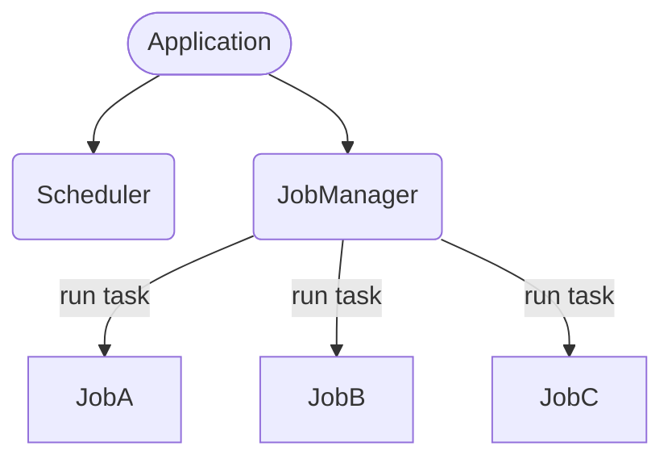
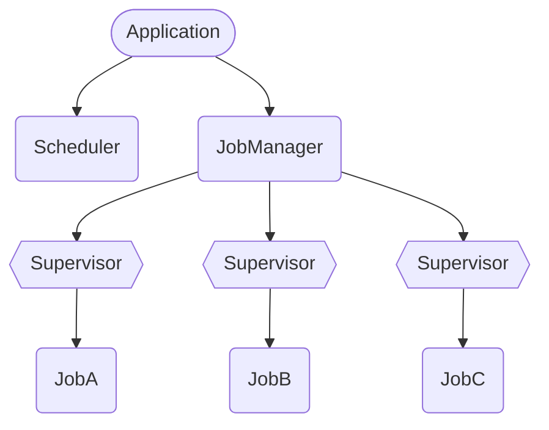
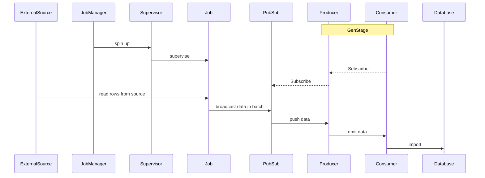
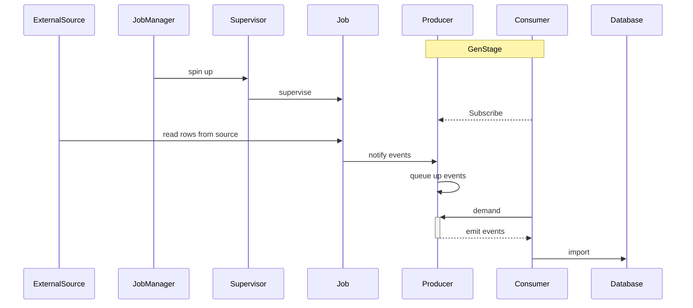

---
# try also 'default' to start simple
# theme: apple-basic
theme: seriph

# layout: intro
# random image from a curated Unsplash collection by Anthony
# like them? see https://unsplash.com/collections/94734566/slidev
background: https://source.unsplash.com/collection/94734566/1920x1080
# apply any windi css classes to the current slide
class: 'text-center'
# https://sli.dev/custom/highlighters.html
highlighter: shiki
# some information about the slides, markdown enabled
info: |
  ## Slidev Starter Template
  Presentation slides for developers.

  Learn more at [Sli.dev](https://sli.dev)
---

# Elixir Way by revisiting a project


@gzzengwei

---

# Starting

- 🧑‍💻 **About Me**
  * long time rubist
  * like engineering/ops stuffs
  * getting into FP/elixir

<v-click>

- 🤹 **About this talk**
  * an ealry elixir project
  * revisiting / improvement

</v-click>

<v-click>

- 🎥 **Disclaimer**
  * learning in progress
  * spark/poc, not all verified in production

</v-click>

<!--
- Did my first few elixir projects as kind of experiments
- Do full time elixir for around a year
- Reviewing the projects I done, Wondering what approach I would do if I do it again
- The project is relativly simple yet have real world requuirements
- During the spark, I think the journey might be a good topic for beginner to get to know elixir


- entry level, in production the config of the params will be more complex and could take long time to config
-->

---

# Project backgrounds

- 🚜 An importer for CSV files from external source
- 🛎 Data source is updated daily (cronjob)
- 🔗 There are up to 50+ csv types (different job types)
- 📈 Data is to dump to db directly for BI purpose (downstream target)
- 🎏 CSV schema changes occasionally (exceptions could happen)
- 📺 A simple dashboard is required to integrate in main app (web interface)


---

# Choosing the stack

<br />

<p style="text-align: center;">
  <h2> Ruby / Elixir </h2>
</p>

<!--

- multi csv types: job workers

- A UI dashboard: web service

ruby
  - sidekiq/activeJob
  - rails/sinatra
  - Redis

-->

---

# Demo

- 👻 Simple job process service
- 🎷 Dummy code to demo some of elixir basic modules

<br />

<v-click>

#### So, we are going to start with something very simple ...

</v-click>

<!--

Terminal:

git checkout v01

- explain job/job_manager/supervisor
- run happy/bad path
- enable Scheduler, try both paths

Issues:
- sequential takes time, waste infra resouces
- exeption will break rest of the loop, also the caller process

-->

---

# Task

- 🎃 conveniences for spawning and awaiting tasks
- 👺 execute one particular action throughout their lifetime
- 🦖 little or no communication with other processes
- 🏄🏾‍♂️ convert sequential code into concurrent code by computing a value asynchronously
- Simple usage: `start` and `async`

<!--

Terminal:

git checkout v02

- changes: `Task.start`
- run happy/bad path
- enable Scheduler, try both path
- sometimes will need task results, also a place to store the state

-->

---

# GenServer

- ⛹🏿‍♀️ A behaviour module for implementing the server of a client-server relation.
- 🦚 A process to keep state, execute code asynchronously and so on
- 💫 Standard set of interface functions, includes tracing and error reporting

<!--

My understanding
- Implemetation of Actor Model
- elixir is FP languange, and GenServer is goto place store and due with state
- Communicate with other process by exchange of sending messages

Terminal:

git checkout v03

- changes:
  - Application -> enable JobManager in supervisor children
  - JobManager -> GenServer
  - Task.start -> Task.async
  - Save task results to state
  - Job -> has a return value

- run happy path, then check state

:sys.get_state(JobDemo.JobManager)

- run bad path, show: jobs not finished/JobManger restarted
- uncomment job.ex s rescue block to show error handling

-->

---

# Issues

- Often we are running many processes, like many Job types in the example
- When single process dies, and it should not effects others, and its parent process
- process should be isolated when crashed, and restart

---

# Supervisor

- 🔍 Supervises other processes
- 🌲 supervision tree: hierarchical process structure
- 🔥 provide fault-tolerance/encapsulate how app start/shutdown

---

# Structure Diagram

<div grid="~ cols-2 gap-4" m="-t-2">
<div>

**Current supervision tree**



</div>

<v-click>

<div>

**With Supervisor**


</div>

</v-click>

</div>

<!--
Terminal:

git checkout v04

- changes:
  - Application -> DynamicSupervisor
  - creates JobSuperviosr, restart polices
  - Job -> GenServer
  - JobManager init -> start JobSuperviosr via DynamicSupervisor

:sys.get_state(JobDemo.JobManager)

- run happy/bad path, to show JobManager not effected
:sys.get_state(JobDemo.JobA) # show last_done
:sys.get_state(JobDemo.JobB) # show nil last_done
-->


---

# New Issue

- 💥 Everything works fine, until ..
- 🦀 A big tenant has large csv file(s) in both size and qunatity
- 🥀 Hit by DB error

```
(DBConnection.ConnectionError socket closed (the connection was closed by the pool,
possibly due to a timeout or because the pool has been terminated))
```
- 🍿 Data reach peak once cronjob triggers, and flood the DB with all the concurrent tasks
- 🚦 DB simple cannot handle the load

---

# Revisit the workload

- 🍄 sequential: taking too long and waste of infra resouces
- 🚗 concurrent without control: too much pressures on downstream service in short time

<v-click>

- 🎸 The job actually split into 2 parts
  - **Upstream**: Data fetching(read rows from csv file(s))
  - **Downstream**: Import the rows to db

</v-click>

<v-click>

- 🛫 Split the workflow to (multi) stages that we have control of

</v-click>

---

# GenStage

- 🛸 data-exchange steps that send and/or receive data from other stages
- 🥽 producer: stage sends data; consumer: it receives data;
- 🦷 some stages can be both producer and consumer
- 🌸 back-pressure mechanism: consumer is sending demand upstream, the producer will emit items


<v-click>

**Data flow:**

[Producer] -- data --> [ProducerConsumer] -- data --> [Consumer]

</v-click>

<v-click>

**Demand flow:**

[Producer] <-- ask for data -- [ProducerConsumer] <-- ask for data -- [Consumer]

</v-click>

---

# Let's do some spark

- 🐠 **producer** : sending rows from csv file(s)
- 🐢 **consumer** : Importing data to db
- 🐯 issue: data source is passive(trigger by cronjob)
- 🍀 we need something in between reading data in files and emitting data


---

# First version: Pubsub

- 🐙 Why Pubsub
- 🐣 A buffer between Job/Producer



<!--

Why? I havn't read the docs throuthoroughly enough

Terminal:

git checkout v05

- changes:
  - Application -> PubSub/Producer/Consumer
  - Job ->
    - run: use stream
    - pubsub: broadcast
  - JobType: simulate range/data
  - Producer: subscribe to PubSub
  - Consumer: subscribe to Producer/ use sleep simulate run

- run happy path to show consumer log
- run bad path to show JobA/C works
- update job range to 1000s to show discards events
- update application consumer number and rerun

-->

---

# Buffering demand

- 💦 Handle cases that:
  - events arrive and there are no consumers
  - consumers send demand and there are not enough events
- 🌴 link: https://hexdocs.pm/gen_stage/GenStage.html#module-buffering-demand

## BroadcastDispatcher

- 🐚 Accumulates demand from all consumers before broadcasting events to all of them.
- 🦢 Guarantees that events are dispatched to all consumers within demand range
- Advanced features like `:selector` consumer only subscribe to certain events


<!--

Terminal:

git checkout v06

- changes:
  - remove PubSub
  - Producer: GenStage.BroadcastDispatcher
  - Consumer: subscribe to Producer/ use sleep simulate run


- run happy path to show consumer log
- run bad path to show JobA/C works
- update job range to 1000s to show discards events
- update application consumer number and rerun
- update producer

  def init(state) do
    {:producer, state, dispatcher: GenStage.BroadcastDispatcher, buffer_size: :infinity}
  end

-->

---

# Buffering demand (cont.)

## BroadcastDispatcher with queue

- 🍋 Use erlang `:queue` module (FIFO)
- 🥗 Control over the events and demand by tracking this data locally

<v-click>



</v-click>

<!--

Terminal:

git checkout v07

- changes:
  - Producer:
    - init: new erlang :queue instance
    - handle_call(:notify):
      - add incoming event to queue
      - dispatch pending events in state
    - handle_demand: dispatch incoming and pending events


- run happy path to show consumer log
- run bad path to show JobA/C works
- update job range to 1000s to show discards events
- update application consumer number and rerun
- update producer

  def init(state) do
    {:producer, state, dispatcher: GenStage.BroadcastDispatcher, buffer_size: :infinity}
  end

-->

---

# Summary

- 🥯 More understanding Elixir tools
- 🌈 Tools are powerful but they might require learning curve
- 💐 Confidence in its performance

<v-click>

- 🛠 More to explorer
  - Broadway: Concurrent and multi-stage data ingestion and data processing
  - Commanded: CQRS/EventSourcing

</v-click>

<br />

<v-click>

### Reference

Book by *Svilen Gospodinov*, **Concurrent Data Processing in Elixir**

</v-click>

---
layout: center
class: text-center
---

# Thank You

### Questions ?
