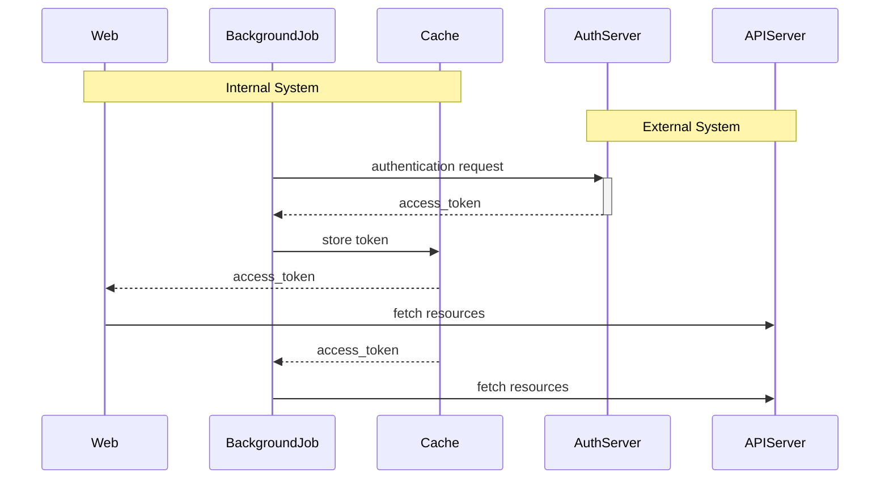
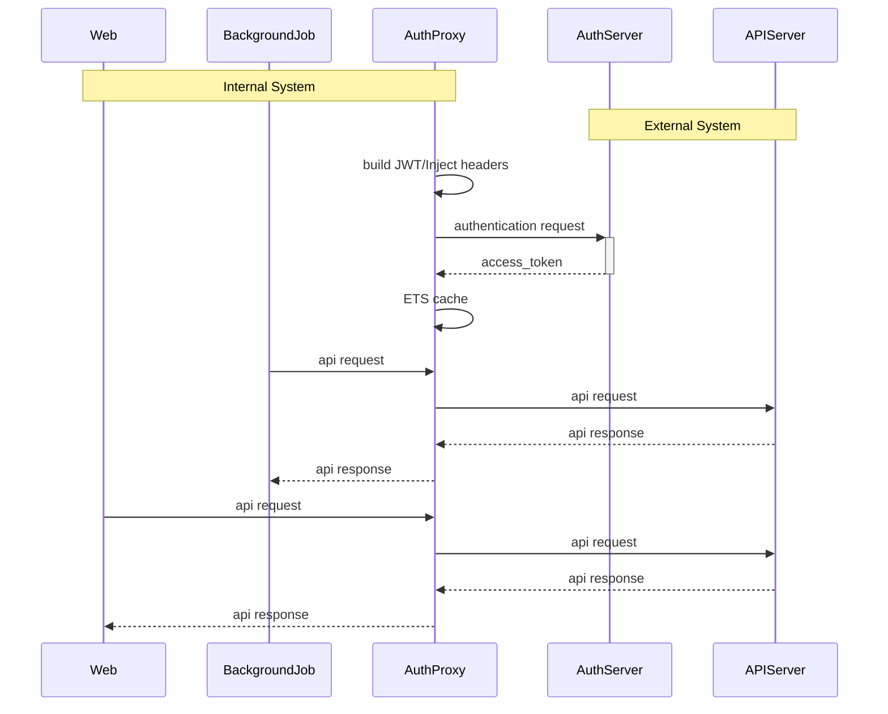

---
# try also 'default' to start simple
# theme: apple-basic
theme: seriph

# layout: intro
# random image from a curated Unsplash collection by Anthony
# like them? see https://unsplash.com/collections/94734566/slidev
background: https://source.unsplash.com/collection/94734566/1920x1080
# apply any windi css classes to the current slide
class: 'text-center'
# https://sli.dev/custom/highlighters.html
highlighter: shiki
# some information about the slides, markdown enabled
info: |
  ## Slidev Starter Template
  Presentation slides for developers.

  Learn more at [Sli.dev](https://sli.dev)
---

# Journey of adopting Elixir


@gzzengwei


---

# Before we start


## - About Me

<br>
<br>


## - About this talk


<br>
<br>


## - Disclaimer


<!--
about me
- like many of you comming from ruby backgroud
- been working with rails for many years
- for last 2 years, I shift part of my work to ops/engineering side to help our migration to k8s platform.
- i m now working in arcade as elixir dev

about this talk

this talk is more a review or simmary of my experience from my previous company, 
how we get to know and introduce elixir to our stack.
also my own experience of chanllege and tricks I learn along the way.

disclaimer

Thank my CTO robert to encourage me to give this talk 
and not only elixir it self but also the stack around it
as the way we adopting elixir I am learning on the way ,so the decision /pratices are surely not best way,
in fact i m hopefully feed back


-->
  

---


## Background

<br>
<br>

### Company:

- Small ruby shop
- Multi tenancy
- Heavy 3rd-party integrations & data exchange

<br>

<v-click>

### tech stack:

- Rails for web
- Customized background jobs(ruby/node)
- Just finished transition to kubernetes

</v-click>

---

## First blood

<br>
<br>

- introduce by ex CTO
- prototype of background job dashboard
- phoenix (1.2) + elm (0.18)
- workers fetching job status from multi tenants under supervisor
- channels push update to frontend

<!--

I m pretty impressed and start to learn it
languange it self has learning curve
phoenix is similar to rails

-->

---

## Moving forward

<br>
<br>

### New OAuth2 integration

<br>

- access_token to be refreshed over half of its life-cycle
- both web and background-job servers need to connect to API


---

## Stack consideration 1

### Within rails code base directly



---

### Within rails code base directly

Pros:

- straight forward
- single change will works for both web/background-job serivces

Cons:
- need cache/db to share token between web/job servers
- additional job to fetch token
- tightly coupled, lack of abiltiy to extend other services

---

## Extracting service #1

### Authentication Proxy

- handle the authentication

- within cluster network, no external ingress needed

- serve web/background-job and potential more services

### Direct Access for Callers(web/background-job)

```bash
## from direct access with `access token` in headers
https://api.third-party.com/resources/:resource_id


## to local k8s cluster access without token
http://auth-proxy.my-namespace.svc.cluster.local/resources/:resource_id

```


---

## Extracting service #2



---

## Extracting service #3

### Fetch token with interval

```elixir
defmodule MyApp.Scheduler.Worker do
  use GenServer

  @default_interval_seconds 1000 * 60 * 50

  def handle_info(:work, state) do
    MyApp.Auth.fetch_token()
    schedule_work()
    {:noreply, state}
  end

  defp schedule_work() do
    Process.send_after(self(), :work, @default_interval_seconds)
  end
end  
```

### Token saved in Cache(ETS) with expiry 

```elixir
  Cachex.put(:token, client_id(), token, ttl: :timer.seconds(cache_ttl_mins()))

```

<!--

Thanks to erlang OTP, it s extreamly easy to create recurring task

and cachex based on ETS, drop in replacement for redis more most cases

-->

---

## Extracting service #4

- it just works! and fast

- can be mantained and deploy separately

- itself is extendable, like caching most frequently/large calls

- low resources consumption

- extendable by other comsumers

--- 

## Goging futher #1

- one of the endpoint provides raw meta data

- BI for data warehouse is planned

- And Importer/AdminGUI service is needed

### New Importer Service

- Talks to the AuthProxy endpoint to fetch data

- process up to 50+ types of CSV daily across tenants

- the stack we choose


---

## Goging futher #2

- FP feels nature while processing data flow

```elixir
  def call(%{module_name: module_name, data: data}) do
    data
    |> Base.decode64!()
    |> unzip_content
    |> import_csv(module_name)
    |> delete_temp_file()
  end

  def import_csv(file_name, module_name) do
    file_name
    |> load_csv(module_name)
    |> Stream.chunk_every(@chunk_size)
    |> Enum.each(&process_rows(&1, module_name))

    file_name
  end

  def load_csv(file_name, module_name) do
    file_name
    |> Path.expand(File.cwd!())
    |> File.stream!()
    |> CSV.decode(headers: true)
  end  
```


---

## Goging futher #3

- `Quantium` cronjob to trigger import

- GenSever worker handle trigger

- move to `Task` to avoid blocking

- use `Torch` for admin GUI
---

## Goging futher #4

### Native CSV lib

- Stream func by default

- Process per line and lazy evaluation

- Low memory usage

### Tips/Tricks #1

- Stream with `chunk_every`

- 2 mins with `Stream.map` + `Ecto.Repo.insert`

- less than 30 seconds with `chunk_every` and `Ecto.Repo.import_all`

- few testing to decide what `chunk_every` value for the case

---

## Kubernetes Basics

- Summary: Automating deployment, scaling, and management of containerized applications.

- Pod: Smallest deployable units of computing that you can create and manage.

- Deployment: A Deployment provides declarative updates for Pods and ReplicaSets.

- Jobs: A Job creates one or more Pods and will continue to retry execution of the Pods until successfully terminate

- Liveness/Readiness Probe: Indicates whether the container is running/ready


---

## Tips/Tricks #2


### Health check Issue

- k8s liveness/readness probe to check service is alive/ready

- query every x seconds

```yaml
  livenessProbe:
    httpGet:
      path: /health_check
      port: http
    initialDelaySeconds: 30
    timeoutSeconds: 10
    periodSeconds: 30

```

---

## Tips/Tricks #2

### Health check Issue

- define in controller

```elixir
defmodule MyAppWeb.HealthCheckController do
  use MyAppWeb, :controller

  def index(conn, _params) do
    conn
    |> send_resp(200, "ok")
    |> halt()
  end
end

```


- it will generate lots of noise in the logs
```bash
2021-07-20 09:35:20.778 request_id=FpN2FHzsg-UyTt0APj2B [info] GET /health_check
2021-07-20 09:35:20.935 request_id=FpN2FHjEwLMoo8oAPj0B [info] Sent 200 in 227ms
```

and `log` option in route not working
```elixir
get "/health_check", HealthCheckController, :index, log: false
```
---

## Tips/Tricks #2


### Bypass request logging

- define endpoint
```elixir
defmodule MyAppWeb.Plug.HealthCheck do
  import Plug.Conn
  def init(opts), do: opts
  def call(%Plug.Conn{request_path: "/health_check"} = conn, _opts) do
    conn
    |> send_resp(200, "ok")
    |> halt()
  end
  def call(conn, _opts), do: conn
end
```

and inject it in Endpoint
```elixir
defmodule MyAppWeb.Endpoint do
  use Phoenix.Endpoint, otp_app: :my_app

  plug(MyAppWeb.Plug.HealthCheck)
```

---

## Tips/Tricks #3

### Migrations

First attempt

```bash
# Dockerfile
CMD [mix ecto.migrate && mix phx.server]
```

Moves from deployment to k8s Job

```yaml
apiVersion: batch/v1
kind: Job
spec:
  containers:
    command:
      - "/app/bin/my_app"
    args:
      - "eval"
      - "MyApp.Release.migrate"

```

---

## Tips/Tricks #3

### Migrations to k8s Job

- separate pod(process) in term of deploy life-cycle

    different log / metric/ exception aggregator

- different image:

    different system libs added

- different resource spec: 

    less resouce for migration while more for production web server


---

## Mix Release

- starts with just mix ecto.migrate/phx.server

- taking too long to compile during production deployment

- move to mix release, including migration to mix task

- pod service up time from 30+sec -> 5sec


---

## Multistage Dockerfile

- single stage Dockerfile, slow CI pipelines

- split stages to elixir, assets, release

- CI build time 2+mins -> 20-30sec  

- Docker image size: 60MB -> less than 20MB


---
    
## performance & resources

with low resources spec
```yaml
resources:
  limits:
    cpu: 1000m
    memory: 1Gi
  requests:
    cpu: 250m
    memory: 512Mi
```

process still working even over the CPU limit thanks to BEAM scheduler's extreamly fast CPU context switching

---
    
### performance & resources diagram


---


### erlang stack


- from `Elixir In Action` by *Sasa Juric*


---

## Overall

- reasonable learing curve (for ruby dev)

- fast develop with framework(phoenix)

- High performance

- Low resource consumption

- Confidence with BEAM OTP

---
layout: center
class: text-center
---

## Thank You

Questions ?


